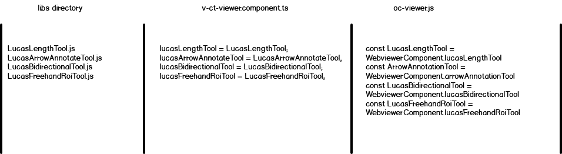
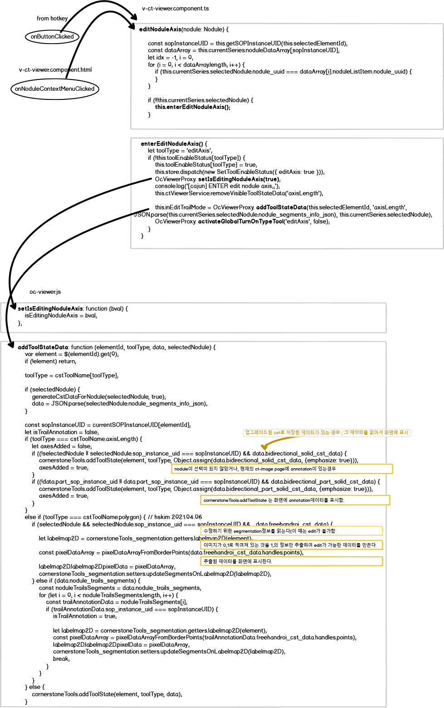
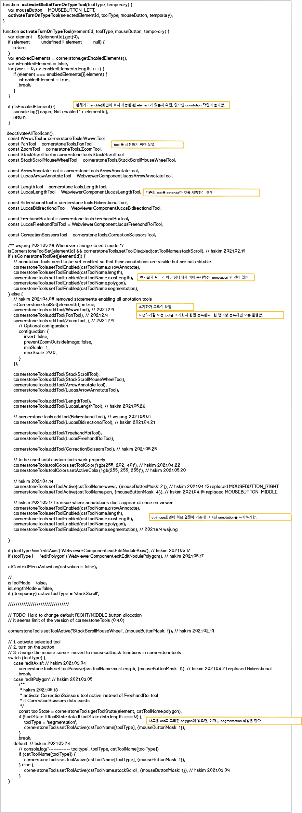
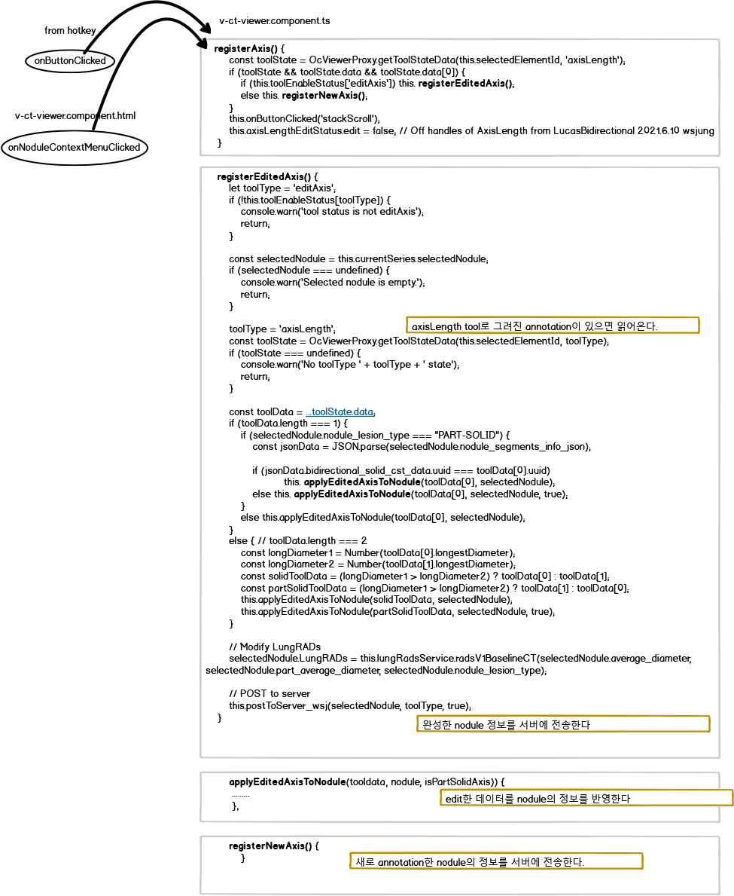

### Installation
npm install 
- cornerstone-core
- cornerstone-tools 
- cornerstone-math
- cornerstone-wado-image-loader
- cornerstone-dicom-parser
- hammerjs
---
### Configuration
in angular.json file
~~~
    "scripts": [
      "node_modules/cornerstone-core/dist/cornerstone.js",
      "node_modules/cornerstone-math/dist/cornerstoneMath.js",
      "node_modules/cornerstone-tools/dist/cornerstoneTools.js",
      "node_modules/cornerstone-wado-image-loader/dist/cornerstoneWADOImageLoader.js",
      "node_modules/dicom-parser/dist/dicomParser.js",
      "node_modules/hammerjs/hammer.js",

~~~

---
### Settings
~~~
in oc-viewer.js

    cornerstone.imageCache.setMaximumSizeBytes(1024 * 1024 * 2048 /* 2048 MB */);
    cornerstoneWADOImageLoader.external.cornerstone = cornerstone;
    cornerstoneWADOImageLoader.external.dicomParser = dicomParser;

    cornerstoneTools.external.Hammer = Hammer;
    cornerstoneTools.external.cornerstone = cornerstone;
    cornerstoneTools.external.cornerstoneMath = cornerstoneMath;
    cornerstoneTools.init({
        mouseEnabled: true,
        touchEnabled: true,
        globalToolSyncEnabled: false,
        showSVGCursors: false,
    });

~~~
---

### Making extends from cornerstoneTools

LucasBidirectionalTool <-- this class name used as new tool
renderToolData.js <-- this file has the detail function for LucasBidirectionalTool.\
cornerstoneTools.addTool(LucasBidirectionalTool); <-- use this tool at  oc-viewer.js\
cornerstoneTools.clearToolState(element, 'LucasBidirectional') <-- used at oc-viewer.js
~~~
export default class LucasBidirectionalTool extends BidirectionalTool {
  constructor(props) {
    const defaultProps = {
      name: 'LucasBidirectional',  <-- this name is used as the tool 
      supportedInteractionTypes: ['Mouse', 'Touch'],
      configuration: {
        changeMeasurementLocationCallback: emptyLocationCallback,
        getMeasurementLocationCallback: emptyLocationCallback,
        textBox: '',
        shadow: '',
        drawHandles: true,
        drawHandlesOnHover: true,
        hideHandlesIfMoving: false,
        renderDashed: false,
        additionalData: [],
      }
    };
    super(defaultProps);

    this.renderToolData = renderToolData.bind(this);
  }
~~~
---
#### The reason why not import method in oc-viewer.js
- import cornerstone from 'cornerstone-core';
- import cornerstoneTools from 'cornerstone-tools'

When tried to **import** module in oc-viewer.js occures following error\
Uncaught SyntaxError: Cannot use import statement outside a module

Tried to resolve this issue as following suggestion, but it fails to apply.

- googling 1: https://gwang920.github.io/error/js-error(1)/
- googling 2: https://velog.io/@iamjoo/Cannot-use-import-statement-outside-a-module

Alternative solution is as following image.
1. Make extend file from cornerstonetools
2. Defined function name in the moderator file (v-ct-viewer.component.ts) , which can be called from oc-viewer.js
3. Assign this function again in the oc-viewer.js

cornestone source : 
- https://github.com/cornerstonejs/cornerstoneTools/blob/d3757960e8ed0f4bfc4e35036e92a9581b664fec/src/tools/annotation/bidirectionalTool/utils/updatePerpendicularLineHandles.js

- https://github.com/cornerstonejs/cornerstone
---
#### Edit Annotation

---
#### Register Annotation

