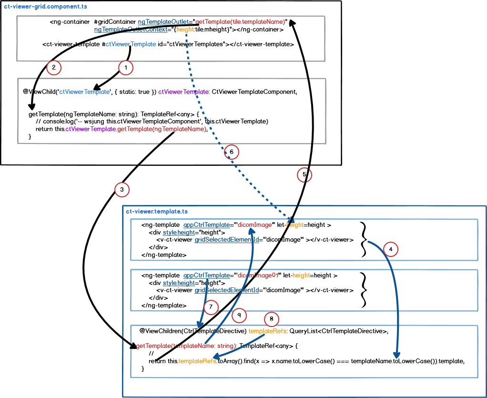

1. ct-viewer.template 를 child로 등록한다.
2. DOM에서 child의 template를 읽기위해 호출한다.
3. child의 template를 template name을 호출한다.
4. template directive에서 template name이 일치하는 template를 찾는다.
5. 찾은 template을 parent에 return한다.
6. parent에서 child component의 template에 height 값을 전달한다. step 5.에서 찾은 template에 height 값을 반영한다.
7. template directive를 배열로 정리한다.
