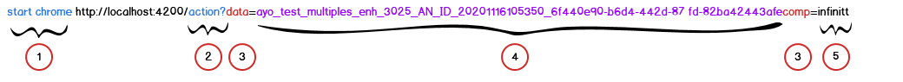
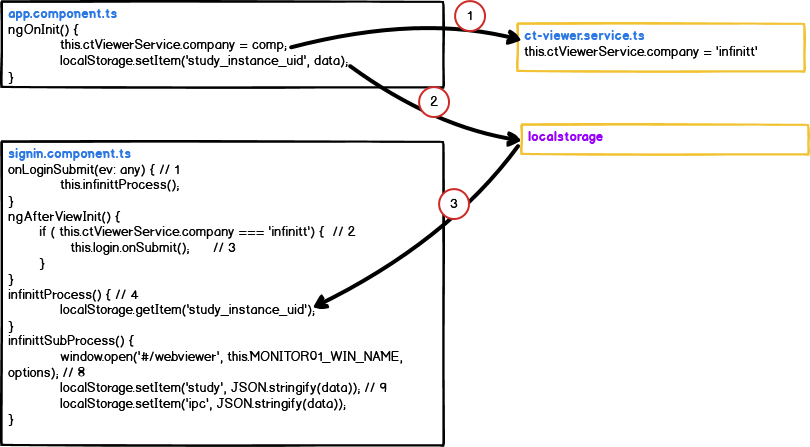

#### Infinitt integration



터미널에서 위의 명령어를 입력한다.
1. windows 명령어
2. chrome 명령어
3. 프로그램에서 데이터를 구분하기 위해 사용하는 키 값.
4. study instance uid
5. 회사 고유 id
---
상기의 명령어를 terminal에서 입력하면,
1. app.component 에서 location.search 로 입력된 값을 읽어온다.
2. 이 입력된 값을 분해하여 data, comp로 분리하고, study_instance_uid를 localstorage 에 저장한다.
   comp 값은 component 간에 값을 공유하기 위하여 ctViewerService에 저장한다.
3. signin.component가 생성되면서 ininitt 연동 작업이 시작된다.
4. 아래의 code snippet 은 signin.component의 일부분이다. 

```ts
    onLoginSubmit(ev: any) {                // 1
        // console.log(' doSignIn ev --', ev )
        this.userInfoService.userInfo = ev;
        if (this.ctViewerService.company === 'infinitt') {
            setTimeout(()=> {
                this.infinittProcess();
            })
        }
        else {
            this.router.navigate(['/webviewer']).then(val => {});
        }
    }
    ngAfterViewInit() {
        
        if ( this.ctViewerService.company === 'infinitt') {     // 2
            this.login.loginForm.setValue({id: 'jung1111', password: '!Q2w3e4r'});
            setTimeout(() => {
                console.log('----ngAfterViewInit--  this.login', this.login)
                this.login.onSubmit();      // 3 
            }, 0);
        }
    }

    infinittProcess() { // 4
        const study_instance_uid = localStorage.getItem('study_instance_uid');
        // const session_uuid = localStorage.getItem('session_uuid');
        this.restAPIService.getStudyInfo(study_instance_uid)
            .subscribe( async study => {
                setTimeout(()=> window.open('', '_self', '').close(),5000); // 5
                
                await this.infinittSubProcess(study[0]);
                await this.restAPIService.getSeriesDcmfilePreview(study[0]);    // 6 
            });
    
    }

    monitor01;
    MONITOR01_WIN_NAME = 'monitor01';
    async infinittSubProcess(tStudy: Study) {
        const study = await this.setSeriesListIntoStudy(tStudy);    // 7
    
        const width = window.screen.width;
        const height = window.screen.height;
        const options = 'resizable=1, scrollbars=1, fullscreen=0, '
            + 'width=' + width + ', height=' + height + ','
            + 'screenX=100 , left=100, screenY=0, top=0, v-toolbar=0, menubar=0, status=0';
        // if (this.monitor01 === undefined) {
        this.monitor01 = window.open('#/webviewer', this.MONITOR01_WIN_NAME, options); // 8
        // this.monitor01 = window.open('www.google.com', this.MONITOR01_WIN_NAME, options);
        console.log('[onStudyItemClickedOnWorklist]', this.monitor01,this.MONITOR01_WIN_NAME);
        this.monitor01.focus();
    
        const data =  {
            id: 'study',
            windowIndex: 0,
            study: study
        };
        localStorage.setItem('study', JSON.stringify(data)); // 9
        localStorage.setItem('ipc', JSON.stringify(data));
    }
    setSeriesListIntoStudy(study: Study): Promise<Study> {
        return new Promise(resolve => {
            this.restAPIService.getSeriesOfStudy(study.study_instance_uid).subscribe((data: SeriesRow[]) => {
                console.log('[setSeriesListIntoStudy] ' + data.length + ' series.');
                //this.currentWorkListSeries.noduleList = [];
                study.seriesList = [];
                
                from(data).pipe(
                    map(row => {
                        const series: Series = new Series();
                        // ..
                        // ..
                        // ..
                        study.seriesList.push(series);
                        return study;
                    }),
                    takeUntil(this.unsubscribe$)
                ).subscribe(study => {
                    resolve(study);
                });
            });
        });
    }
    
```

1. login 화면에 submit 하면 호출된다.
2. ctViewerService.company에 저장된 값이 있으면 외부에서 연동 프로그램을 호출한\
   것으로 판단하고 이미 정해진 사용자 id, password를 직접 입력하여 login이 자동으로 이루어 지도록 한다. 
3. this.login.loginForm.setValue 이 명령어로 login id, password를 입력했고 submit을 했으므로 위의\
   step 1이 동작한다.
4. infinitt 연동 프로그램이 시작된다.
5. main viewer 화면이 열리면 5초후에 login tap이 닫힌다.\
   infinitt 사용자가 logout 했을 때 login 화면이 표시되는 것을 방지하기 위함이다.
6. main viewer 의 series list의 thumbnail을 표시한다.
7. study에 series의 정보를 전부 포함시킨다.
8. study정보로 main viewer을 open 한다.
9. main viwer에 모든 프로세스를 진행한다. 아래의 snippet 참조.
~~~
webviewer.vertical.component.ts

    @HostListener('window:storage', ['$event']) async storageChange(event$) {
        const action = JSON.parse(localStorage.getItem('ipc'));
        if (!!action) {
            switch (action.id) {
                case 'study':
                    if (action.windowIndex === this.windowIndex) {
                        localStorage.removeItem('ipc');
                        await this.ctViewerService.prepareShowSelectedSeriesToViewer(action.study);
                    }

~~~
