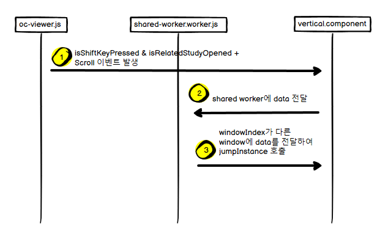

# Longitudinal & Registration 기능
- [Longitudinal](#longitudinal)
- [Registration](#registration)
- [intervalGrowth](#intervalgrowth)
- [pairJump](#pair-jump)
- [SyncScroll](#shift-scroll-sync-scroll)
- [RegistrationMatrix](#ctrl-click-registration-matrix-jump)
- [PairEdit](#pairedit)


### Longitudinal
- Viewer에서 Longitudinal 분석요청을 할 수 있도록 함
- 이 기능은 Main Study, Related Study가 오픈되어 있어야 가능함
- Main Viewer의 상단 Tool 중 Longitudinal icon을 클릭함
    - Re-matching request
    - rollback
        - rollback이 true면 사용자가 수정(add, confirm, delete)한 내용을 고려하지 않음
- 위의 두 개의 버튼은 아래의 step으로 실행됨
    - id별 session open(session check)
    - Re-matching request의 경우, **사용자가 pair에 대해 수정한 내용을 반영할 수 있도록 함**(Add, Deleted된 것들 list 구성을 따로함)
    - Lung Registration 결과 없으면 Registration을 먼저 요청/저장/조회
    - Longintudinal pair 분석 요청/저장/조회
    - 다른 Window에 ipc 호출('**newMatchingCall**')하여 해당 Window에서도 Longitudinal 데이터 조회

    ```ts
    case 'newMatchingCall':
        if (this.windowIndex === action.windowIndex) { return; }
        localStorage.removeItem('ipc');
    
        setTimeout(() => {
            const data = this.ctViewerService.getLongitudinalData();
            this.store.dispatch(new SetFnGetNodules({elementId: this.selectedElementId, series: this.currentSeries}));
            this.noduleMatchingService.get(data);
            this.lungRegistrationService.get(data);
        }, 200);
    
        break;
    ```

### Registration

- Viewer에서 Registration 분석요청 할 수 있음
- Main Viewer의 상단 Tool 중 Longitudinal icon을 클릭함
    - Re-registration request
- 버튼 클릭하여 request, save, get하여 nodule list 등을 재조회함

```ts
// ct-viewer.component.ts
async requestRegistration() {
	  let data = this.ctViewerService.getLongitudinalData();
	  const studyInstanceUID = data.studyInstanceUID;
	  const seriesInstanceUID = data.seriesInstanceUID
	  const comparisonStudyInstanceUID = data.comparisonStudyInstanceUID;
	  const comparisonSeriesInstanceUID = data.comparisonSeriesInstanceUID;
	
	  const seriesDcmFilePath = `/home/monitor/dist/dcm/amanpulo-representative-server/${studyInstanceUID}/${seriesInstanceUID}`;
	  const comparisonSeriesDcmFilePath = `/home/monitor/dist/dcm/amanpulo-representative-server/${comparisonStudyInstanceUID}/${comparisonSeriesInstanceUID}`;
	
	  data.seriesDcmFilePath = seriesDcmFilePath;
	  data.comparisonSeriesDcmFilePath = comparisonSeriesDcmFilePath;
	
	  await this.lungRegistrationService.request(data);

	  const ipcData = {
        id: 'newMatchingCall',
        windowIndex: this.windowIndex
    }
    localStorage.setItem('ipc', JSON.stringify(ipcData));

    this.store.dispatch(new SetFnGetNodules({elementId: this.selectedElementId, series: this.currentSeries}));
}
```

### intervalGrowth

- Main Study, Related Study를 다 Open하면, `PairNodules` List를 조회하고, IntervalGrowth를 계산함
- `noduleList`와 `pairNodules`가 다 `Store`에 update가 되면 intervalGrowth를 계산함
- Related Study는 기본적으로 intervalGrowth가 'Baseline'이고, '-'으로 display됨
- Main Study Window에서 Related Study의 PairNodules와 값과 비교하여 'New', 'NoChange', 'Growing'을 설정함

```ts
// v-nodule-itme-list.component.ts
const pairs$ = this.pairNodules$.pipe(
    skip(1),
    filter(pairs => !!pairs && pairs.length > 0),
    takeUntil(this.unsubscribe$)
);

const nodules$ = this.noduleList$.pipe(
    skip(1),
    filter(nodules => !!nodules && nodules.length > 0),
    takeUntil(this.unsubscribe$)
);

// add average_diameter, volume colume to pair
combineLatest([pairs$, nodules$]).subscribe(([pairs, nodules]) => {
  from(pairs).pipe(
      filter(pair => pair.link_status !== 0),
      switchMap(pair => {
          return from(nodules).pipe(
              map(v => {
                  if (this.windowIndex === 0) { v.intervalGrowth = 'New'; }
                  return v;
              }),
              filter(nodule => nodule.nodule_uuid === pair.nodule_uuid),
              switchMap(res => {
                  pair.average_diameter = res.average_diameter;
                  pair.volume = res.volume;
                  return of(pair);
              }),
              takeUntil(this.unsubscribe$)
          )
      }),
      toArray(),
      takeUntil(this.unsubscribe$)
  ).subscribe(res => {
      if (this.windowIndex === 0) {
          this.store.dispatch(new SetIntervalGrowth(res));
      } else {
          const ipcData = {
              id: 'intervalGrowth',
              windowIndex: this.windowIndex,
              pairNodules: res
          };
          localStorage.setItem('ipc', JSON.stringify(ipcData));
      }
  });

});
```

- 위의 intervalGrowth 계산을 위한 pairNodules가 Store에 update되면, 아래에서 처럼 받아서 계산이 이루어짐
```ts
// v-nodule-itme-list.component.ts
const intervalGrowthState$ = this.intervalGrowth$.pipe(
    skip(1),
    filter(val => !!val && val.length > 0),
    takeUntil(this.unsubscribe$)
);

const comparsionIntervalGrowthState$ = this.comparisonIntervalGrowth$.pipe(
    skip(1),
    filter(val => !!val && val.length > 0),
    takeUntil(this.unsubscribe$)
);

combineLatest([intervalGrowthState$, comparsionIntervalGrowthState$]).subscribe(([main, comparison]) => {
    from(main).pipe(
        switchMap(val => {
            return from(comparison).pipe(
                find(com => com.comparison_nodule_uuid === val.nodule_uuid),
                filter(v => v !== undefined),
                switchMap(com => {
                    val.diameterDiff = val.average_diameter - com.average_diameter;
                    val.volumeDiff = val.volume - com.volume;
                    return of(val);
                }),
                takeUntil(this.unsubscribe$)
            )
        }),
        switchMap(main => {
            return from(this.noduleList).pipe(
                filter(val => val.nodule_uuid === main.nodule_uuid),
                switchMap(n => {

                    n.intervalGrowth = main.diameterDiff > 1.5 ? 'Growing' : 'NoChange';
                    n.diameterDiff = main.diameterDiff.toFixed(1);
                    n.volumeDiff = main.volumeDiff.toFixed(1);

                    return of(n)
                }),
                takeUntil(this.unsubscribe$)
            )
        }),
        toArray(),
        takeUntil(this.unsubscribe$)
    ).subscribe();
});
```

### Pair Jump 

- Nodule 클릭시 Pair 존재하면 Jump, 존재하지 않으면 Registration Matrix 사용하여 비슷한 위치 image로 Jump
- Nodule List에서 nodule을 클릭하면, onMouseDown이 호출 → event.isTrusted로 사용자가 직접 click한 것인지 체크함
- `pairNodules`와 비교하여, 클릭한 nodule이 pair를 가지고 있는지 확인
- pair 있음: ipc call('`pairNodule`')하여 다른 window에 nodule 클릭했다고 알려줌
- pair 없음: ipc call('`lungRegistration`') Registration Matrix 사용하여 좌표 계산

```ts
onMouseDown(data) {
	.....
	let isMatched = false;
	if (event.isTrusted && !!this.pairNodules) {
	    from(this.pairNodules).pipe(
	        takeUntil(this.unsubscribe$),
	        map((val) => {
	            if (selectedNodule.nodule_uuid === val.nodule_uuid) {
	                if (val.link_status !== 0) {
	                    isMatched = true;
	                    const data = {
	                        id: 'pairNodule',
	                        data: val.comparison_nodule_uuid,
	                        windowIndex: this.windowIndex
	                    };
	                    localStorage.setItem('ipc', JSON.stringify(data));
	                }
	            }
	        }),
	        finalize(async () => {
	            if (!isMatched) {
	                // lung registration call
	                const coordinates = {
	                    'sopInstanceUID': selectedNodule.sop_instance_uid,
	                    'series_instance_index': selectedNodule.series_instance_index,
	                    'coordY': selectedNodule.nodule_coordinate_y,
	                    'coordX': selectedNodule.nodule_coordinate_x,
	                };
	    
	                const comparisonCoordinates = await this.lungRegistrationService.coordinate(coordinates);
	                const ipcData = {
	                    id: 'lungRegistration',
	                    windowIndex: this.windowIndex,
	                    result: comparisonCoordinates
	                };
	                localStorage.setItem('ipc', JSON.stringify(ipcData));
	            }
	        })
	    ).subscribe();
}
```

```ts
// webviewer-vertical.component.ts
case 'pairNodule':
  // nodule item 클릭시 pair 있을 때 호출됨
  if (action.windowIndex !== this.windowIndex) {
      localStorage.removeItem('ipc');
      from(this.noduleList).pipe(
          find(val => {
              return action.data === val.nodule_uuid
          }),
          takeUntil(this.unsubscribe$)
      ).subscribe(result => {
          if (!!result) {
              const data = {
                  isPairNodule: true,
                  noduleUUID: result.nodule_uuid
              };
              this.store.dispatch(new SetIsPairNodule(data));
          } else {
              // remove selectedNodule
              this.currentSeries.selectedNodule = undefined;
              OcViewerProxy.setSelectedNoduleIndex(-1);
              this.store.dispatch(new SelectNodule(new Nodule()));
              this.store.dispatch(new SetCurrentSeries(this.currentSeries));
          }
      });
  }
  break;

// v-nodule-item-list.component.ts
// pair가 있을때
this.isPairNodule$.pipe(
    skip(1),
    filter(val => val.isPairNodule),
    takeUntil(this.unsubscribe$)
).subscribe(val => {
    this.vNoduleItemComponentList.find(x => {
        return x.nodule.nodule_uuid === val.noduleUUID;
    }).onItemClick();
});
```

```ts
// webviewer-vertical.component.ts
// pair가 없을때
case 'lungRegistration':
  if (action.windowIndex !== this.windowIndex) {
      localStorage.removeItem('ipc');
      if (action.result) {
          const instanceArray = OcViewerProxy.getInstances(this.selectedElementId);
          const finalIndex = instanceArray.length - 1;

          const coordZ = action.result.coordZ > finalIndex ? finalIndex : action.result.coordZ;
          console.log('[lungRegistration] finalIndex, coordZ: ', finalIndex, coordZ);
          OcViewerProxy.jumpToInstance(this.selectedElementId, coordZ);
          // OcViewerProxy.hideCenterProgress();
      }

      // remove selectedNodule
      this.currentSeries.selectedNodule = undefined;
      OcViewerProxy.setSelectedNoduleIndex(-1);
      this.store.dispatch(new SelectNodule(new Nodule()));
      this.store.dispatch(new SetCurrentSeries(this.currentSeries));
  }
  break;
```

### Shift scroll Sync Scroll

- scroll sync는 Shared Worker 사용하여 속도개선
- SharedWorker 등록
- oc-viewer.js에서 호출한 scrollSync는 scrollSyncWorker에 data를 전달하면, sharedWorker는 다른 windows에 메시지를 전달함

```ts
// webviewer-vertical.component.ts
// register scrollSync worker
this.scrollSyncWorker = new SharedWorker('./assets/scripts/shared-worker.worker.js');
this.scrollSyncWorker.port.onmessage = ({data}) => {
    if (data.windowIndex !== this.windowIndex) {
        const increase = data.increase;
        const newImageIndex = this.ctViewerService.getCurrentImageIndex(this.selectedElementId) + increase;
        OcViewerProxy.jumpToInstance(this.selectedElementId, newImageIndex); // 2021.8.5
    }
};
this.scrollSyncWorker.port.start();

// oc-viewer로 부터 호출됨
scrollSync(data: any) {
        this.scrollSyncWorker.port.postMessage(data);
}
```

```jsx
// shared-worker.worker.js
connections = [];

self.onconnect = function(connectEvent) {
    const port = connectEvent.ports[0];
 
    port.start();
    connections.push(port);
    
    port.onmessage = function(messageEvent) {
        connections.forEach(connection => {
            connection.postMessage(messageEvent.data);
        });
    }
};
```

```ts
// oc-viewer.js
// cornerstonetoolsstackscroll
$(element).on('cornerstonetoolsstackscroll', function (e) {

  // Manually display direction
  var direction = e.originalEvent.detail.direction;
  if (direction === 0) {
      return;
  }

  // set current image index for display
  var imageIndex = imageStack.currentImageIdIndex;

  currentImageInstanceId[elementId] = instances[elementId][imageIndex];
  currentImageIndex[elementId] = imageIndex;
  showThisNoduleOnlyIndex = -1;

	// getIsScroll() : shift, related study open 여부 확인
  if (getIsScroll()) {
      var sendMessage = {
          windowIndex: getWindowIndex(),
          increase: direction
      };
      VerticalComponentWrapper.scrollSync(sendMessage);
  }
});

```


### Ctrl Click Registration Matrix Jump

- subject를 사용해 ctrl+click event는 oc-viewer에서 받고, 이벤트가 발생하면 click 좌표값을 next호출하여 이벤트 발생시켜 vertical component에 넘김
- 설정해놓은 subscribe에서 lungRegistration ipc call이 실행됨
```ts
// webviewer-vertical.component.ts
OcViewerProxy.callSetRegistrationSubject(this.registrationSubject);
if (!!OcViewerProxy.callGetRegistrationSubject()) {
    OcViewerProxy.callGetRegistrationSubject().subscribe(async (coordinates) => {
        // nodule registation rest api call
        const comparisonCoordinates = await this.lungRegistrationService.coordinate(coordinates);
        const ipcData = {
            id: 'lungRegistration',
            windowIndex: this.windowIndex,
            result: comparisonCoordinates
        };
        localStorage.setItem('ipc', JSON.stringify(ipcData));

        // }
    });
}
```
```jsx
// oc-viewer.js
$(element).on('cornerstonetoolsmouseup cornerstonetoolsmouseclick', function (e) {
	...
	if (e.originalEvent.detail.event.ctrlKey) { // hskim 2021.02.19
      // ctrl과 클릭이 같이 들어왔을 때, x, y 좌표를 ct-viewer로 넘기기
      var coordinates = {};
      coordinates.series_instance_index = currentImageIndex[elementId];
      coordinates.sopInstanceUID = currentSOPInstanceUID[elementId];
      coordinates.coordX = e.originalEvent.detail.currentPoints.image.x;
      coordinates.coordY = e.originalEvent.detail.currentPoints.image.y;
      registration$.next(coordinates);
  }
	...
}
```

## PairEdit
- 사용자가 Pair를 add / update / delete

### addPair
- 사용자가 pair를 직접 연결하는 기능
- nodule을 오른쪽 클릭 → context menu open → Nodule Link → Add
- **(addPair 모드)** 다른 한 쪽 화면에서 nodule pair로 연결 가능한 nodule item이 보여짐
    
```ts
// webviewer-vertical.component.ts
case 'addPairNodule':
        if (this.windowIndex === action.windowIndex) { return; }
        localStorage.removeItem('ipc');
        const nodule = action.nodule;

        // remove selectedNodule
        this.currentSeries.selectedNodule = undefined;
        OcViewerProxy.setSelectedNoduleIndex(-1);

        this.store.dispatch(new SelectNodule(new Nodule()));
        this.store.dispatch(new SetCurrentSeries(this.currentSeries));
        **this.store.dispatch(new AddPairNodule({
            nodule: undefined,
            comparisonNodule: nodule
        }));**
        break;
```
    
```ts
// v-nodule-itme-list.component.ts
this.addPairNodule$.pipe(
    skip(1),
    takeUntil(this.unsubscribe$)
).subscribe(**pairNodule** => {
    if (pairNodule === undefined) {
        this.isAddedPair = false;
        this.isAddingPair = false;
        return;
    }

    if (pairNodule.nodule !== undefined) {
        this.isAddedPair = true;
    } else {
        this.isAddedPair = false;
    }

    if (pairNodule.comparisonNodule !== undefined) {
        this.isAddingPair = true;
    } else {
        this.isAddingPair = false;
    }
});
```
    - pairNodule는 object 형태
        `{ nodule: undefined,  comparisonNodule: nodule }`

- pair가 가능한 nodule 중 클릭하여 pair 연결: `onMouseDown()`
- Link Confirm Dialog에서 확인버튼 클릭 이후
    - addNoduleMatching
    ```ts
    const noduleMatchingRequestUUID = `USER_MANUALLY-${this.userInfoService.userId}-${uuid.v4()}`;
    const userConnection = [{
        noduleMatchingRequestUUID,
        'noduleUUID': selectedNodule.nodule_uuid,
        'comparisonNoduleUUID': this.addPairNodule.comparisonNodule.nodule_uuid,
        'type': 2 // 0: Deleted, 1: None, 2: Added(Confirmed)
    }];
    
    this.ctViewerService.addNoduleMatching(userConnection);
    ```
    
    - reverse하여 저장
    ```ts
    // addNoduleMatching reserve
    const addData = {
        id: 'saveReverseForPair',
        windowIndex: this.windowIndex,
        type: 'addPair',
        comparisonNodule: selectedNodule,
        userConnection: [{
            noduleMatchingRequestUUID,
            'noduleUUID': this.addPairNodule.comparisonNodule.nodule_uuid,
            'comparisonNoduleUUID': selectedNodule.nodule_uuid,
            'type': 2 // 0: Deleted, 1: None, 2: Added(Confirmed)
        }]
    };
    localStorage.setItem('ipc', JSON.stringify(addData));
    ```

    ```ts
    // webviewer-vertical.component.ts
    case 'saveReverseForPair':
      if (this.windowIndex === action.windowIndex) { return; }
      localStorage.removeItem('ipc');
    
      const type = action.type;
      if (type === 'addPair') {
          this.store.dispatch(new AddPairNodule({
              nodule: this.addPairNodule.nodule,
              comparisonNodule: action.comparisonNodule
          }));
          this.ctViewerService.addNoduleMatching(action.userConnection);
      } else if (type === 'updatePair') {
          this.ctViewerService.updateNoduleMatching(action.userConnection);
      }
      break;
    ```

### confirmPair & deletePair == updatePair
- AI 결과 pair에 대해 confirm OR delete하는 기능
- nodule을 우클릭 → context menu open → Nodule Link → Confirm OR Remove
- addPair와 마찬가지로 updatePair도 reverse하게 저장
    - reverse하게 저장할 수 있도록 ipc 호출함

```ts
from(this.pairNodules).pipe(
    filter(pair => pair.nodule_uuid === nodule.nodule_uuid && pair.link_status !== 0),
    take(1)
).subscribe(result => {
    // 2. confirm pair
    const noduleMatchingRequestUUID = result.nodule_matching_request_uuid;
    const userConnection = [{
        noduleMatchingRequestUUID,
        'noduleUUID': result.nodule_uuid,
        'comparisonNoduleUUID': result.comparison_nodule_uuid,
        'type': 2   // 0: deleted, 1: None, 2: Added(Confirmed)
    }];
    this.updateNoduleMatching(userConnection);
    // this.requestNoduleMatching(userConnection);

    // confirm reverse
    const data = {
        id: '**saveReverseForPair**',
        windowIndex: this.windowIndex,
        type: 'updatePair',
        userConnection: [{
            noduleMatchingRequestUUID,
            'noduleUUID': result.comparison_nodule_uuid,
            'comparisonNoduleUUID': result.nodule_uuid,
            'type': 2
        }]
    };
    localStorage.setItem('ipc', JSON.stringify(data));
});
```


