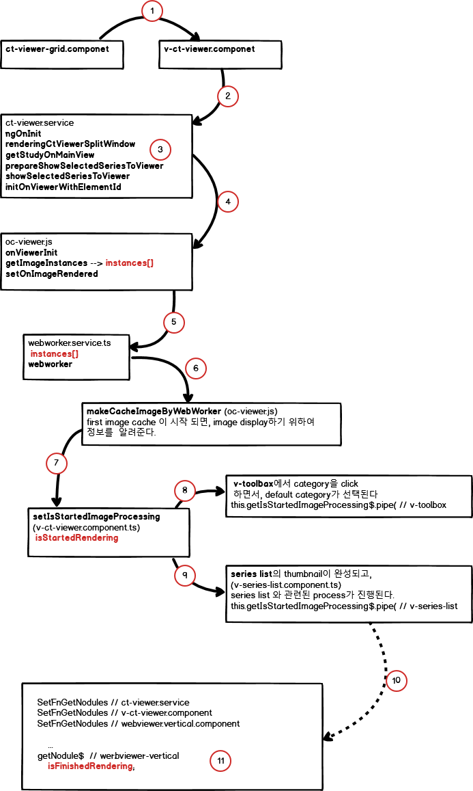

1. grid를 선택하면, 선택한 grid의 cols, height, template 정보를 정한다음,
   그선택한 grid의 갯수 만큼 rendering할 elementId를 파라메터로 하여 연속으로  호출한다.
2. grid로 부터 호출되면, elementId 값을 input 값으로 v-ct-viewer.component를 호출한다. 그 elementId를 기준으로 ct-image rendering 작업이 시작된다.
   이때 grid가 복수개 선택 되었을 때는  (#dicomImage, #dicomImage01 ,#dicomImage02, #dicomImage03),
3. 첫번째 elementId( #dicomImage)가 처리가 완료( isFinishedRendering )이 될때까지 두번째 elementId( #dicomImage01 )은 대기하고 있어야 한다.
4. renderingCtViewerSplitWindow에서는 isStartedRendering, isFinishedRendering 작업을 기준으로 다음 프로세스
   진행사항을 통제한다.
5. 하나의 elementId를 처리하는 과정에서 study, series 정보로 부터 모든 image id 가 포함된 instances 정보를  서버에서  읽어온 정보를 기준으로
   webworker가 작업을 시작한다.
6. webworker에서 하나의 image id 씩 makeCahedImageByWebWorker를 호추하여 cache에 저장한다.
7. 저장한 후 바로  그 결과를 webworker에 통보하여 그 다음 image id를 처리한다.
   최초의 image id를 처리하고 나서 바로 ct- image를 display하는 작업을 진행하고,
8. toolbox에서 category의 초기값을 세팅한다.
9. 이때 series list의 thumbnail정보를 만들고,
10. 이렇게 이미지를  viwer에 표시한다,
11. getfNodule를 진행한 결과를 마지막 단계 isFinishedRnedering 를 세팅한다.
    이때 nodule list가 생성된다.


```ts
ngOnInit (v-ct-viewer.component)         
    renderingCtViewerSplitWindow (v-ct-viewer.component)         
        getStudyOnMainView (ct-viewer.service)       
            prepareShowSelectedSeriesToViewer (ct-viewer.service)
                showSelectedSeriesToViewer (ct-viewer.service)
                    initOnViewerInitWithElementId (ct-viewer.service)
                        onViewerInit (ov-viewer.js)
                            getImageInstances (oc-viewer.js)
                    --> get ct-image preview as array. instances[]
                            setOnImageRendered (oc-viewer.js)
                    startDownload (webworker.service.js)
                    --> By using webworker, process each image of instances[] one by one; 
```

### Process of WebWorker for Ct Image loading.
이전 방식은 이미지로더를 외부에서 작성하여 연결하는 방식으로 사용했는데,
이때는 이미지 한개의 id를 읽은 다음에 한장씩 loadAncCacheImage함수를 사용 했는데,
새로운 방식은 cornerstoneWadoImageLoader를 연결하여 이미지 처리를 하는데,
이 방식은 한꺼번에 전체 이미지 id를 읽은 다음에 이미지를 한장씩 처리하기 때문에 이미지를
캐시하는 중에 study를 전환(left arrow key, right arrow key)하는 것이 안되기 때문에
(전체 이미지를 읽은 다음에 페이지가 이동되는 현상)
한 번에 이미지 id를 한개씩 읽어서 한개의 이미지를 처리하는
과정 때문에 아래의 프로세스를 적용하였음

