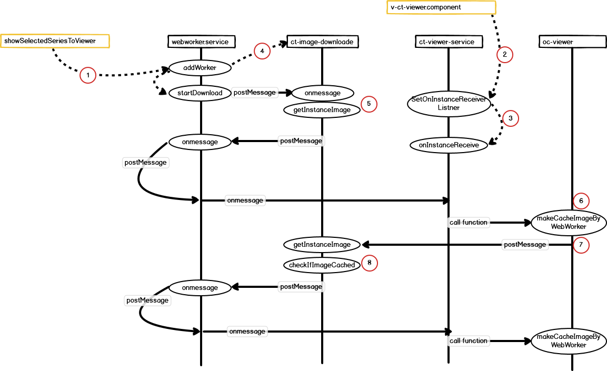

1. Study가 선택되면( 혹은 바뀌면) addWorker를 시작한다. 이떄 webworker script file을 등록한다.
2. Study가 선택되면( 혹은 바뀌면) webworker script file (ct-image-loader)로 postmessage를 하면
3. 메시지를 받을 수 있는 함수를 선언한다.
4. addWorker를 수행한 후 바록 startDownload 이떄 instances[]를 전달하고
5. 전달된 onmessage의 instances의 정보를 getInstanceImage함수로 넘겨서 이때 부터 이미지 id 한개씩 처리한다
6. getInstanceImage함수에서 하나의 image id를 webworker.service를 보내면, 이때 onmessage에 연결된
   onInstanceReceive에서 image id를 받아 oc-viewer에 있는 makeCacheImageByWerWorker를 호출한다.
7. 이 image id로 서버에서 image 수신하여 cache 저장한다.
8. 저장한 결과를 getInstanceImage에 전달하면, checkImageCached에서 6.에서 보낸 image id가 잘 처리되었는지
   확인한 수 다시 6.의 과정을 instances[] 의 이미지가 다 처리될 때까지 반복한다.
9. 8.의 과정을 반복하는 과정에서 study가 바뀌면, 1. 번 부터 다시 시작한다.

