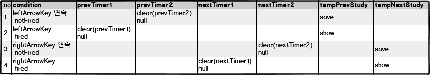

#### Process of changing study by left_arrow_key or right_arrow_key.


1. leftArrowKey, not fired:
    - 바로 전에 leftArrowKey를 누른 것이 fired가 안된경우.
    - prevTimer1을 세팅한다.
    - prevTimer2를 리셋한다.
    - nextTimer1를 리셋한다. (rightArrowKey를 누르고, fired되기 전에 leftArrowKey로 바꾼경우)
    - nextTimer2를 리셋한다. (rightArrowKey를 누르고, fired된 직후에 leftArrowKey로 바꾼경우)
    - 키로 이동할 때 마다 현재의 study를 tempPrevStudy에 저장한다.
2. leftArrowkey, fired:
    - 바로 전에 lefArrowKey를 누른 것이 fired 된 경우.
    - prevTimer2을 세팅한다.
    - prevTimer1를 리셋한다.
    - tempPrevStudy를 표시한다.
3. rightArrowKey, not fired:
    - 바로 전에 rightArrowKey를 누른 것이 fired가 안된경우.
    - nextTimer1을 세팅한다.
    - nextTimer2를 리셋한다.
    - prevTimer1를 리셋한다. (leftArrowKey를 누르고, fired되기 전에 rightArrowKey로 바꾼경우)
    - prevTimer2를 리셋한다. (leftArrowKey를 누르고, fired된 직후에 rightArrowKey로 바꾼경우)
    - 키로 이동할 때 마다 현재의 study를 tempNextStudy에 저장한다.
2. rightArrowkey, fired:
    - 바로 전에 rightArrowKey를 누른 것이 fired 된 경우.
    - nextTimer2을 세팅한다.
    - nextTimer1를 리셋한다.
    - tempNextStudy를 표시한다. 

```ts
    case 'openNextStudy': // right arrow key
        if (!this.nextTimer1) {
            this.openNextStudyOnSlaveWindow();
            this.nextTimer2 && clearTimeout(this.nextTimer2);
            this.prevTimer1 && clearTimeout(this.prevTimer1);
            this.prevTimer2 && clearTimeout(this.prevTimer2);
            this.nextTimer2 = null;
            this.nextTimer1 = setTimeout(() => {
                this.openNextStudyOnSlaveWindow(true);
            }, this.EXPIRE_TIME);
        } else  {
            this.openNextStudyOnSlaveWindow();
            this.nextTimer1 && clearTimeout(this.nextTimer1);
            this.nextTimer1 = null;
            this.nextTimer2 = setTimeout(() => {
                this.openNextStudyOnSlaveWindow(true);
            }, this.EXPIRE_TIME);
        }
        break;
    case 'openPreviousStudy': // left arrow key
        localStorage.removeItem('ipc');
        if (!this.prevTimer1 ) {
            this.openPreviousStudyOnSlaveWindow();
            this.prevTimer2 && clearTimeout(this.prevTimer2);
            this.nextTimer1 && clearTimeout(this.nextTimer1);
            this.nextTimer2 && clearTimeout(this.nextTimer2);
            this.prevTimer2 = null;
            this.prevTimer1 = setTimeout(() => {
                this.openPreviousStudyOnSlaveWindow(true);
            }, this.EXPIRE_TIME);
        } else  {
            this.openPreviousStudyOnSlaveWindow();
            this.prevTimer1 && clearTimeout(this.prevTimer1);
            this.prevTimer1 = null;
            this.prevTimer2 = setTimeout(() => {
                this.openPreviousStudyOnSlaveWindow(true);
            }, this.EXPIRE_TIME);
        }
        break;


```
