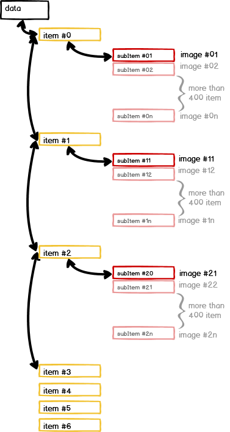

### Technic 1

#### Requirement:

1. Get the image from the first SubItem to make a thumbnail, which means only one image is enough.
2. Data (root object) has children object(Item), Item has children object(SubItem).
3. If data has five childrend(Item), it has five thumbnail image. that is need to display.
4. Each SubItem has the image url;




```ts
Conditions
1. Need to connect to remote server that has the data.
2. Consider async communication to get the data through http connection

class Data {
    itemList: Item[];
}
class Item {
    subItem: SubItem[];
}
class SubItem {
    imageUrl: url;
}

getMain( data: Data) {
    const itemList = data.itemList;     // 1. 
    return from(itemList).pipe(
        takeUntil(this.unsubscribe$),
        mergeMap( item => {             // 2. 
            const url1 = `http://${defined_host_ip}:3333/${data.id}/sub_items${item.id}`
            return this.http.get(url1).pipe(
                map( val => val[0]),    // 3, 4. 
                switchMap( subItem => {             // 5. 
                    const url2 =`http://${defined_hist_ip2}:3334/${data.id}/sub_items${item.id}/preview${subItem.id}`;  
                    return this.http.get(url2, {responseType: 'blob'}).pipe( 
                        tap( resp => {
                            someFunction(resp); // 6. 
                        })
                    )
                })
            )
        }),
    ).subscribe()
}
```
1. Data has item list, each item has item.id
2. Need to get subItems from server without considering response sequence.
3. This return value has multiple subItems, but only the first one is needed
4. operator mergeMap makes result as array format.
5. After step(4), new arrary data is created, and this data baton passed to the next step.  
6. Do the final step
