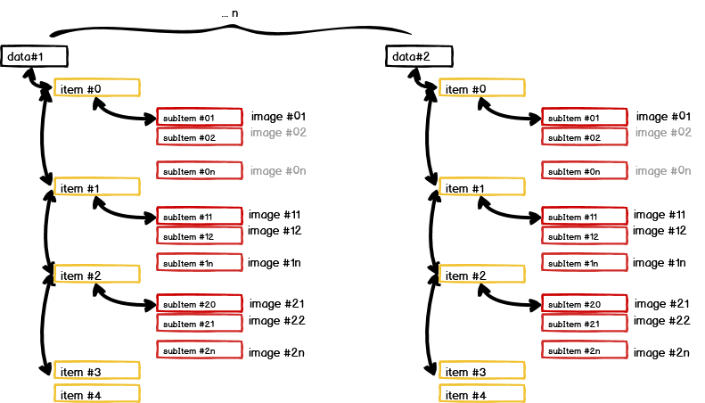

## Technic2 page

1. 3 step nested object, parent(data) has children (nested objects) and children has childrend (nested objects)
2. There are many parents, data#1, data#2, data#n
3. Grand children(subItem) has a image address, image#01, image#02, image#0n
4. Finally, image addresses need to be saved as a file, which has all the relation from parent to child,\
to local stoarage with the name of parent id.
 



```ts
downloadJsonData(dataList) {
    let savedJson = {};
    return from(dataList).pipe(                 // 1.
        takeUntil(this.unsubscribe$),
        mergeMap((data: Data[]) => {            // 2.
            const da = data;
            savedJson[da.id] = {};              // 3
            return http.get.getSeriesOfStudy(da.id);
        }),
        // [{..}, {..}, {..}]                   // 4.
    ).subscribe((itemList) => {
        from(itemList).pipe(
            takeUntil(this.unsubscribe$),
            mergeMap((item) => {
                const it = item;
                savedJson[da.id][it.id] = {};    // 5.
                return http.get.getNodules(it.id); 
            }),
            // [{..}, {..}, {..}, {..}]
        ).subscribe((subItemList: any[]) => {
            return from(subItemList).pipe(
                takeUntil(this.unsubscribe$),
                map(subItem => {
                    const da_id = subItem['da_id']; // 6.
                    const it_id = subItem['it_id'];
                    const su_id = subItem['su_id'];

                    if (!savedJson[da_id][it_id][su_id]) {
                        savedJson[da_id][it_id][su_id] = [];        // 7.
                    }
                    // 
                    ...
                    savedJson[da_id][it_id][su_id].push(some_data); // 8.
                    ...
                    return savedJson;
                }),
                /* // 9.
               {da_id:
                   {it_id: 
                       {su_id: Array(2)
                         0: {...}
                         1: {...}
                        }
                    }
                   {it_id: 
                       {su_id: Array(3)
                         0: {...}
                         1: {...}
                         2: {...}
                        }
                    }
                }
               {da_id:
                   {it_id: 
                       {su_id: Array(1)
                         0: {...}
                        }
                    }
                   {it_id: 
                       {su_id: Array(4)
                         0: {...}
                         1: {...}
                         2: {...}
                         3: {...}
                        }
                    }
                }
            */
            ).subscribe(newJson => {
                const keys = Object.keys(newJson); // 10.
                from(keys).pipe(
                    takeUntil(this.unsubscribe$),
                    concatMap(key => of(key).pipe(takeUntil(this.unsubscribe$),delay(100))), // 11.
                    tap(key => {
                        const data = JSON.stringify(newJson[key]);
                        const blob = new Blob([data], {type: 'application/json'});
                        // save files at the download directory
                        saveAs(blob, key); // 12.
                    })
                ).subscribe();
            });
        });
    });
}
```
1. Input data list int rxjs from event.
2. Request data from server without considering response sequence.
3. Assign id, which is id of one item from the array list, as key value for savedJson object.
4. Result value from the async communication by the id of item is array list.
5. This step is the same as above step 1, 2, 3, 4,\ 
   With this result assign the second key value for the savedJson object.
6. subItem has the key value of parent and grand parent.
7. Assign the third key valur the savedJson object.
8. Put the value to the savedJson.
9. Result will be as comment display. (console.log)
10. It's time to save the savedJson as JSON file for each data (file name will be data.id)
11. Writing each data to local file is a kind of async process, and can't receive the writing result after writing complate.\
    so, whenever writing file, make delay time for writing, which can prevent from skipping writing file.
12. save file by using library.
    
